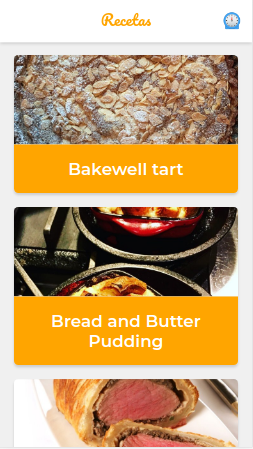
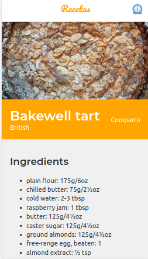
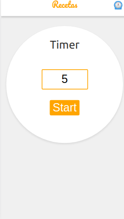

# Progresive Web App (PWA)

PWA que utiliza la API de MealDB para mostrar recetas con sus instrucciones. Algunas de las features que tiene son:

- Soporte Offline con Workbox
- Estrategias de Red apropiadas para cada recurso
- Add to Home Screen
- Web Share API
- Creado con [Create React App](https://github.com/facebookincubator/create-react-app).





## Scripts

- `npm install` para instalar las dependencias
- `npm run dev` para entorno de desarrollo
- `npm run build && npm start` para producción

# Que son las PWA?

Es un estandar de calidad mobile first.

Hay estudios que demuestran la importancia de lograr que tu sitio funcione rápidamente en dispositivos móviles:

- 50% de los usuarios se van de un sitio que tarda más de 3 segundos en cargar.
- Cada segundo de demora nos cuesta un 5-10% de nuestras ventas.

Vamos a centrarnos en tres cosas a lo largo de este curso:

- Performance.
- Instalable en Homescreen.
- Dar soporte Offline.

<https://www.pwastats.com/>
<https://wpostats.com/>

# Google Lighthouse

Es una herramienta oficial de Google que viene con Chrome, con la cual podemos hacer un diagnóstico a una Web App. Estos diagnósticos se centran en Performance y Accesibilidad, pero también tiene una herramienta para diagnosticar si nuestra Web App se considera una PWA o no y que pasos debemos de tomar para que lo sea.

Lighthouse no sustituye hacer pruebas con un dispositivo móvil real, siempre realiza pruebas en un dispositivo móvil.

El diagnostico de Performance nos muestra dos de los conceptos más importantes en performance: First meaningful Paint y First interactive.

- **First meaningful Paint o primer pintado significativo** (TTFMP), esto señala cuanto tiempo tardo el navegador en renderizar la aplicación de una forma que tenga sentido. Generalmente queremos que este situado entre 1 y 2 segundos.

- **First interactive o primera interacción** TTI, señala el tiempo cuando ya se cargó React, inicializo la aplicación y que podamos correr comandos dentro de la aplicación/ Interactuar con ella.

¿Cómo bajamos estos tiempos?

Para bajar el Time To First Meaningful Paint podemos hacer Server Side Rendering, reducir el tamaño de nuestro HTML y CSS o simplemente teniendo servidores más rápidos.

El Time To Interactive tiene mucho que ver con el framework que estemos utilizando, usualmente queremos que tarde menos de 5 segundos.

# Web Manifest (Feature Add to Homescreen)

El archivo Manifiesto es una forma de indicar a los navegadores web, y en especial a los dispositivos móviles, cómo mostrar tu App. Es básicamente un archivo JSON donde específicas diversas propiedades con sus valores los cuales son:

- **short_name**: Es el nombre que se utiliza en la Homescreen.
- **name:** Es el nombre de nuestra aplicación.
- **icons:** Especifica un array de imágenes que servirán como iconos de la aplicación.
- **start_url:** Nos indica en que página comienza nuestra aplicación, por compatibilidad siempre conviene que sea “/” en lugar de “./index.html”.
- **display:** Define el modo de visualización para la aplicación. Standalone significa que la aplicación puede correr por su misma.
- **theme_color:** Define qué color vamos a usar en la barra de tareas de Android para que combine con nuestra aplicación.
- **related_applications:** Sirve si queremos que Chrome en el Add to Homescreen recomiende una aplicación del Store.

# Service Worker

Son la característica más importante de una PWA.

Es lo que hace posible que las PWA funcionen, es un script que nuestro navegador corre detrás de escena y este no puede tocar el DOM, solo expone un api con la cual podemos establecer la conexion.

Los service workers solo funcionan en producción.

El service worker de Create React App hace algo llamado “SW Precache“, lo que hace es precargar y dejar disponibles offline todos los archivos necesarios para correr la aplicación. Una recomendación a la hora de hacer debugging es refrescar el sitio pues un service worker por lo general se inicializa después de la primera carga.

Para implementar nuestro propio service worker usaremos Workbox, una librería creada por Google para crear Service Workers.

Otras herramientas:
https://github.com/hanford/next-offline
https://github.com/GoogleChrome/workbox

# Workbox

<https://developers.google.com/web/tools/workbox/>

El funcionamiento de un service worker por defecto toma una lista de assets para precargarlos y si la ruta coincide exactamente con un asset entonces lo tomara de cache.

Workbox tiene una característica llamada registerNavigationRoute la cual se encarga de hacer el funcionamiento por defecto de un service worker

## Estrategias de carga

<https://developers.google.com/web/tools/workbox/modules/workbox-strategies>

Existen diferentes estrategias de carga.

- **Network Only**

Esta se encarga checar si hay conexión a internet, si existe una conexión realiza la petición de información, en caso de no haber conexión se rompe la página.
¿Cuándo usar Network Only?
Por defecto si no queremos cache o manejamos información en tiempo real.


- **Network First**
  es otra estrategia de carga, se encarga mandar la petición a internet, si la conexión a internet esta caída entonces tomara la información que tenga almacenada en cache.
  ¿Cuándo usar Network First?
  Cuando queremos la última versión de un asset y tener soporte offline.


- **Cache First.**

Es una estrategia de carga que lo primero que hace es ir al cache y si encuentra el recurso lo sirve directamente. En caso de no encontrarlo va a ir a red, guardar la información en cache y servir esa versión.

Esta estrategia puede ser peligrosa y solo es recomendable cuando queremos máxima velocidad y estamos manejando un recurso que nunca cambia, como una imagen o alguna fuente.


- **Stale While Revalidate**

Esta es una estrategia de carga muy particular y que mejor funciona a la hora de mejorar el rendimiento. Lo que hace es ir a cache y a red al mismo tiempo, toma la versión más rápida que siempre será la de cache y en cuanto recibe la de red va a actualizar la versión de cache.

Es recomendable esta estrategia cuando queremos mucha velocidad y estamos manejando un recurso que puede estar levemente desactualizado.


NOTA: Al momento de escribir nuestras estrategias en Workbox SI IMPORTA el orden en que pongamos las cosas, si queremos una estrategia o regla por defecto debemos poner esa regla hasta el final de todo.

# Google Analytics

Como primer paso debemos incorporar react-ga, un plugin que nos permite correr Google Analytics dentro de React.

Workbox ya cuenta con un método para facilitar que Google Analytics funcione de forma offline, va a capturar todas las peticiones que hagamos a GA, las va a guardar en memoria y cuando el usuario retome la conexión a internet se enviaran las peticiones.

# Web Share API

<https://www.w3.org/TR/web-share/>

Nos permite usar el Share nativo del sistema operativo.

Para implementarlo hay que tener presente que solo funcionara si hacemos click a algún link, esto es una medida de precaución para que nadie abuse de la API obligándonos a tener que compartir algo que no queremos. Web Share API solamente funciona con HTTPS.

```
    if (!navigator.share) {
      alert("Your browser doesn't support Web Share API");
      return;
    }

    const { recipe } = this.state;

    navigator
      .share({
        title: `${recipe.name}`,
        text: `${recipe.category} ${recipe.origin}`,
        url: document.location.href,
      })
      .then(() => alert('SHARED!'))
      .catch((error) => alert(error));
```

# Offline UI

La forma de saber si la aplicación esta offline u online es a través de una variable llamada Navigator.onLine, algo muy importante a tener en cuenta es que la variable nos va a decir que estamos online siempre y cuando no estemos offline lo cual significa que si el usuario tiene mala conexión a internet igual va a marcar como online.

```
import React, { useState, useEffect } from 'react';

export default function IfOffline({ children }) {
  const [onLine, setOnLine] = useState(navigator ? navigator.onLine : true);

  useEffect(() => {
    if (!window) return;
    window.addEventListener('online', goOnLine);
    window.addEventListener('online', goOffLine);

    return () => {
      window.removeEventListener('online', goOnLine);
      window.removeEventListener('online', goOffLine);
    };
  });

  const goOnLine = () => {
    setOnLine(true);
  };
  const goOffLine = () => {
    setOnLine(false);
  };

  if (onLine) {
    return null;
  }

  return <span>{children}</span>;
}

```

# Notifications

Una de las funcionalidades más populares de las PWA son las Notificaciones.

Existen tres tipos de permiso para las notificaciones:

- Estado por defecto:(DEFAULT) no sabemos si podemos enviar notificaciones o no, aquí es donde debemos preguntarle al usuario si quiere recibir las notificaciones.
- Granted: el usuario ha concedido el permiso.
- Denied: directamente no podemos enviar las notificaciones.

Primero que nada, debemos preguntar si nuestro navegador puede mandar notificaciones. Para ello vamos a checar si hay un objeto Notification en window y un Service Worker en el navegador, esto es así debido a que en Android necesitamos un Service Worker para que las notificaciones funcionen. En iOS no hay soporte para notificaciones.

```
 if (!('Notification' in window) || !('serviceWorker' in navigator)) {
      return alert("Your browser doesn't support notifications");
    }

    // Chequear permisos
    if (Notification.permission === 'default') {
      await Notification.requestPermission();
    }
    if (Notification.permission === 'block') {
      return alert('Shame on you!');
    }

    if (Notification.permission !== 'granted') {
      return;
    }

```

```
    const registration = await navigator.serviceWorker.getRegistration();
    if (!registration) {
      alert('Service Worker not found');
      return;
    }
    registration.showNotification('Done', {
      body: 'ding ding ding ',
      img: '/taco.png',
    });
```

# Herramientas

- <https://ngrok.com/> For quick demos and other simple tunneling needs.
- <https://letsencrypt.org/>

## Licencia 📄

MIT

## Conceptos Aprendidos 🤓

- <https://platzi.com/courses/pwa-react-js/>

## Certificado

- [Diploma](./readme-static/diploma-pwa-react-js.pdf)

---

👩‍💻 with ❤️ by [silnose](https://github.com/silnose) 😊
